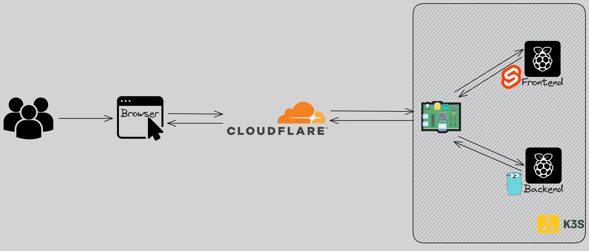
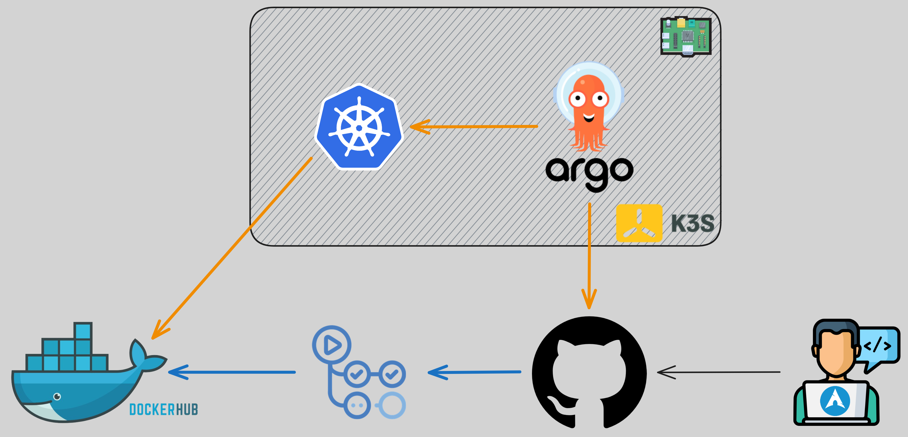

+++
title = 'Golang Webserver on RPi 4 with Kubernetes'
date = 2024-05-16T22:00:00+03:00
draft = false
+++

## Introduction

This whole endeavour started out of my desire to learn `Golang` and the whole process one would have to go through to deploy an application. In my day to day job I mostly deal with already existing infrastructure - whether it's the LGTM Grafana Labs stack, already existing deployments or so on. I've never had the opportunity to do the entire process end to end. Might as well just do it. 

This project is built upon the backbone of [what was built in the previous blog post](https://www.adrian-docs.com/posts/argocd_and_gitea/).

### Quick links

Deployed in this article: https://agg.adrian-docs.com/
Repositories used: 
- https://github.com/aliasboink/go_rss_aggregator_stripped
- https://github.com/aliasboink/go_rss_aggregator_stripped_helm_chart
- https://github.com/aliasboink/go_rss_aggregator_stripped_frontend

## Technologies Chosen

The list of technologies/programming languages/tools used is as follows:
- Golang
- Svelte
- Kubernetes
- K3s
- Helm Chart
- Docker
- ArgoCD
- etc...

### Why Golang?

`Golang` is pretty widely used in the context of solving infrastructure problems. I find a number of things about the language quite pleasant - even if some lead to quite a bit of tedium (very explicit error handling by repeating 3 LoC). Their interactive tutorial is quite good, but I found [boot.dev](https://www.boot.dev/) to be an exquisite source for learning it - so that's what I used initially and what inspired the RSS Aggregator as it is a project on their website!

The guided project doesn't tell you **how** to do things, just **what** to do - which is a pretty good approach to get over the initial hump of "not knowing what to build" with a new tool one's learning.

### Why Svelte?

Through this project I have concluded that the frontend environment is a jungle. The amount of `JavaScript frameworks is insane - as indicated by the existence of: [Days Since Last JavaScript Framework](https://dayssincelastjavascriptframework.com/). 

First off I tried toying around with `React` some - felt too heavy handed for such a small project. `Angular` - same issue. Ultimately I looked over a plethora of possibilities and settling for `Svelte` as: 
1. It has quite a nice interactive tutorial
2. `Svelte 5` had been released and the frontend developers were happily surprised - might as well trust them
3. It has a lot of positive feedback on getting something running fast - which I what I want

### Why Kubernetes and Helm Chart and ArgoCD and...

This boils down to familiarity. I've, to some degree, worked with all of these tools before. This means the benefits are twofold: I get to learn to a bit more of the tools I'm using and it will be a more seamless experience to deploy the application after it's done.

## Design

This is split into two: 
- Infrastructure -> how everything is setup and how the components communicate
- CI/CD -> how everything is integrated and deployed... continuously

### Infrastructure

Ideally everything is obfuscated as much as possible and the enduser has the least amount of privileges possible - this would also mean obfuscating the backend entirely. 

In my case, infinite scrolling is a must. Therefore the design I chose for this, as it was easiest to implement, is to have both the frontend and backend publicly exposed. To this end a `CloudFlare Tunnel` was used. As I already had one pointing to this domain, all I had to do was [configure the ingress](https://developers.cloudflare.com/cloudflare-one/connections/connect-networks/configure-tunnels/local-management/configuration-file/) accordingly and it worked like a charm. Finding the proper documentation for this was a bit of a headache, but after knowing it's possible and having an example it required very little tinkering. 

The result is the following:

The end user uses the browser to access https://agg.adrian-docs.com/. The requests are sent to `CloudFlare`. From there they're sent to my `Raspberry Pi 4` via the `CloudFlare Tunnel` and there they're organized by hostname. Each hostname has a certain `Kubernetes` service associated with it in the configuration of the tunnel. That's it.

### CI/CD 

The entire workflow is depicted here:

`Blue` **->** pushes to frontend/backend; trigger a workflow to create a new Docker image

`Orange` **->** pushes to repositories monitored by `ArgoCD`; they're continuously polled by `ArgoCD` and once a change is updated the deployment is synced to reflect it

There are two ways this workflow can be used:
1. Proper
    1. Make a change to the frontend/backend with a new release.
    2. Update the `Helm Chart` values file to point to the new tag of the image.
    3. `ArgoCD` syncs everything up.
2. How-I-sometimes-do-it-due-a-desire-to-not-have-a-high-number-of-image-tags-when-I-want-to-make-quick-changes
    1. Make a change to the frontend/backend and overwrite the previous image.
    2. Restart the `ArgoCD` component.

(1) is far more proper and `ArgoCD` can handle it better without any downtime. 

(2) is when you don't care about said downtime and want to make a quick change. I use a combination of the two depending on what I wanna do - as I can afford it while dealing with a small pet project.

## Possible Improvements

Possible improvements could be (to name a few):
- Secret Handling 
- Frontend
- CI/CD

### Secret Handling

I haven't gone over this, but the `Kubernetes Secrets` that are important are created manually and then the applications receive them as environment variables. The manual creation is the issue - typically one would use an a secret manager and simply pull the secrets from said secret manager. Something like Hashicorp Vault if you're really going the extra mile - which I am not. In my case I have the data from the secrets saved locally together with the YAML manifests. These are deployed locally via a script.

### Frontend 

I'm awful at it as it currently stands. I put it together as quick as I can while learning as much as I can in the shortest possible time to have a decent result. Mind you, the CSS is all handwritten with the exception of [Flexbox Grid](http://flexboxgrid.com/#top) which proved to be very handy and has a very small footprint.

Besides touching up what already exists, features can be added that allow sorting, pulling a different amount of data, and so on. This may also require changes on the backend depending on how far one goes with the features.

### CI/CD

There are plenty manual steps here. Releases are not automated. `ArgoCD` doesn't pick up an image if the tag is the same (last time I checked the feature was in beta). So and so forth, but I don't consider it necessary to change these aspects as the project is very small in size and I prefer to have the control over these steps as they're not something one may forget - and if I do I can just check this post!

## Where is the RSS Aggregator accessible?

You can access the RSS Aggregator [here](https://agg.adrian-docs.com/)!

