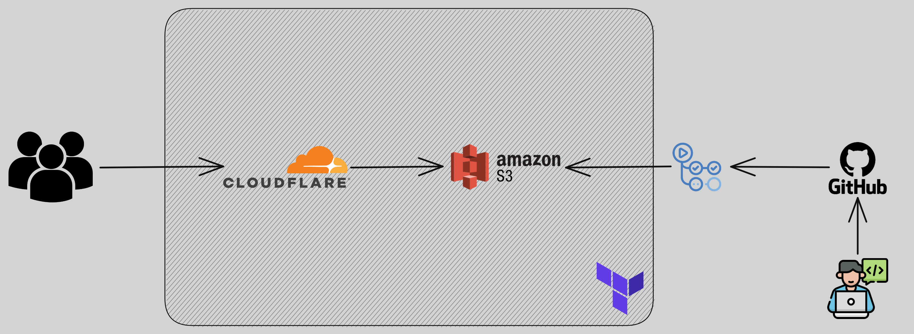

+++
title = 'Serverless Website with Cloudflare and AWS'
date = 2023-10-09T15:06:42+03:00
draft = false
+++

## Introduction

Initially I wanted an AWS project - whatever that may be, as I am (at the time of writing) studying for SAA-C03. Someone pitched me the idea of hosting a personal website which can also serve as a portofolio for such projects, so here it is.

Initially I looked at making it entirely within AWS (using `Route 52` & `CloudFront`), yet `CloudFlare` came to mind and the plethora of features they offer alongside it being free, well, outside of the domain itself. The only costs inquired are for the domain and the `S3` bucket. The data will be proxied via `CloudFlare` onto the `S3` bucket which hosts the website. Everything is handled by `CloudFlare` as long as the DNS records are properly set.

Now that that's been established, the question is what to write the website with? To that end I was recommended `Hugo` by a friend, a simple lightweight static website generator written in `Golang` and used through `markdown`. `Hugo` will generate the website in `public/` and this will be pushed onto the S3 bucket.

For deployment of infrastructure `Terraform` will be used. This will be used for the creation of all `AWS` resources and the `CloudFlare` records.



*Conceptually*, on the left side the users make a request to `CloudFlare` and that is forwarded to the `S3` bucket. This is true for the subdomain bucket. *Practically*, the apex bucket redirects all requests to www.adrian-docs.com and then the same workflow happens - the apex bucket is not showcased in the diagram. The apex bucket is not shown in the diagram. 
On the right side is the GitHub workflow - which simply utilizes `GitHub` actions to deploy the website on the bucket upon a push.

## Installing Hugo

`Hugo` has a dependency on `Golang` - which has to be installed first. Their quickstart guide is sufficient to get a website running. Several configurations can be added in the `hugo.yaml` file and new pages can be written in `markdown` - each page can be created with a command such as `hugo new posts/example-post.md`. By running `hugo server -D` you can locally test each and every change on `localhost:1313/`.

## Building the Infrastructure

To this end `Terraform` is used. The website infrastructure will be in a seperate repository than the website itself. The repository will be structured like so:
```bash
website_blog_infra
├── cloudflare.tf
├── export_env.bash
├── main.tf
├── s3_apex.tf
├── s3_subdomain.tf
└── variables.tf
```
Here is what each folder will contain:
* cloudflare.tf -> deployment of two DNS records and fetching some data using the `CloudFlare` provider
* export_env.bash -> setting environment variables that Terraform uses, will not be committed to the repository
* main.tf -> statefile and provider configuration
* s3_subdomain.tf -> deployment of the `S3` _subdomain_ bucket alongside its policies and configuration
* s3_apex.tf -> deployment of the `S3` _apex_ bucket alongside its policies and configuration
* variables.tf -> declaration of the terraform variables and their defaults

### Providers configuration and backend

The following is the `main.tf` fille: 

```HCL
terraform {
  required_providers {
    aws = {
      source  = "hashicorp/aws"
      version = "5.20.0"
    }
    cloudflare = {
      source  = "cloudflare/cloudflare"
      version = "4.16.0"
    }
  }

  backend "s3" {
    bucket = "website-blog-terraform"
    key    = "state/main"
    region = "eu-central-1"
  }
}
```

There are two things going on here. 
1. The first are the providers. There are two providers, CloudFlare and AWS, and the latest version has been hardcoded for each.
2. The `S3` backend. This is a bucket manually created and setup to function as the place where `Terraform` places the statefile in. 

### The S3 Buckets

As per the [CloudFlare documentation](https://developers.cloudflare.com/support/third-party-software/others/configuring-an-amazon-web-services-static-site-to-use-cloudflare/) 2 buckets have to be created. It is necessary for the buckets to have the same name as the subdomain (www.adrian-docs.com) and apex (adrian-docs.com). The apex `S3` bucket redirects every request to the subdomain itself - which will then proxy the requests to the `S3` bucket. One aspect I don't adhere to from the documentation is leaving a bucket entirely open, both only allow access from the CloudFlare network itself. The following is the `s3_subdomain.tf` file:

```HCL
resource "aws_s3_bucket" "subdomain" {
  bucket = var.bucket_name_subdomain
  tags   = var.global_tags
}

resource "aws_s3_bucket_public_access_block" "subdomain_access" {
  bucket = aws_s3_bucket.subdomain.id

  block_public_acls       = true
  block_public_policy     = false
  ignore_public_acls      = true
  restrict_public_buckets = false
}

data "aws_iam_policy_document" "subdomain" {
  statement {
    actions   = ["s3:GetObject"]
    resources = ["${aws_s3_bucket.subdomain.arn}/*"]

    principals {
      type        = "*"
      identifiers = ["*"]
    }

    condition {
      test     = "IpAddress"
      variable = "aws:SourceIp"
      values   = concat(data.cloudflare_ip_ranges.cloudflare.ipv4_cidr_blocks, data.cloudflare_ip_ranges.cloudflare.ipv6_cidr_blocks)
    }
  }
}

resource "aws_s3_bucket_policy" "subdomain" {
  bucket = aws_s3_bucket.subdomain.id
  policy = data.aws_iam_policy_document.subdomain.json
}

resource "aws_s3_bucket_website_configuration" "subdomain" {
  depends_on = [aws_s3_bucket_public_access_block.subdomain_access]
  bucket     = aws_s3_bucket.subdomain.bucket

  index_document {
    suffix = "index.html"
  }

  error_document {
    key = "404.html"
  }

}
```

The most notable aspect of this `S3` configuration is the policy. It only permits access to `CloudFlare` IP ranges which are specified in another fire as a data source. Besides that aspect - it is a simple configuration to host a static website. The `s3_apex.tf` is near identical - with the sole difference being the following:

```HCL
resource "aws_s3_bucket_policy" "apex" {
  bucket = aws_s3_bucket.apex.id
  policy = data.aws_iam_policy_document.apex.json
}

resource "aws_s3_bucket_website_configuration" "apex" {
  depends_on = [aws_s3_bucket_public_access_block.apex_access]
  bucket     = aws_s3_bucket.apex.bucket

  redirect_all_requests_to {
    host_name = var.bucket_name_subdomain
  }

}
```

The `host_name` variable under `redirect_all_requests_to` is equal to the name of the previously created bucket - which in this case is (mandatory to be) www.adrian-docs.com - thanks to both of these buckets both the apex and the subdomain work!

### CloudFlare

```HCL
data "cloudflare_ip_ranges" "cloudflare" {}

resource "cloudflare_record" "subdomain" {
  zone_id         = var.cloudflare_zone_id
  name            = "www"
  value           = aws_s3_bucket_website_configuration.subdomain.website_endpoint
  type            = "CNAME"
  ttl             = 1
  allow_overwrite = false
  comment         = "This is a necessary value otherwise the Cloudflare TF Provider cries."
  proxied         = true
}

resource "cloudflare_record" "apex" {
  zone_id         = var.cloudflare_zone_id
  name            = "adrian-docs.com"
  value           = aws_s3_bucket_website_configuration.apex.website_endpoint
  type            = "CNAME"
  ttl             = 1
  allow_overwrite = false
  comment         = "This is a necessary value otherwise the Cloudflare TF Provider cries."
  proxied         = true
}
```

In this file the DNS records for `CloudFlare` are created alongside with the IP's being sourced. The alias names - `www.adrian-docs.com` and the apex `adrian-docs.com` both redirect to the bucket which only permits traffic from `CloudFlare` itself. This is how the website is fetched so the visitors (you!) can see it. The TTL is automatically chosen by `CloudFlare` (indicated by giving it the value `ttl = 1` here) - this is a requirement if you decide to have the requests proxied.
The caveats regarding this one are pretty interesting. The `CloudFlare` `Terraform` provider is awful - the intiial deployment will fail unless `allow_overwrite`, `proxied` and `comment` are explicitly mentioned. Now if I am to change anything in the configuration I need to also specify the `tags` variable otherwise the DNS records will fail to change. `tags` are not allowed in the free-tier - therefore there is no way I can do such a thing unless I decide to upgrade my subscription. 
There are three possibilities here:
1. Explicitly delete the DNS records and then recreate them when a change is desired.
2. Upgrade my subscription so I can use the `tags`.
3. Fix the `CloudFlare` `Terraform` provider.
Out of these (3), the last would be the best - yet that would go besides the scope of this project. (2) goes against the choice of `CloudFlare` - which is being cheap. Therefore I'm left with for now (1) by process of elimination - unfortunately.

## The GitHub Pipeline!

This is kept simple:

```yaml
name: website_deploy

on:
  push:
    branches: [ main ]
  pull_request:
    branches: [ main ]

env:
    AWS_ACCESS_KEY_ID:  ${{ secrets.AWS_ACCESS_KEY_ID }}
    AWS_SECRET_ACCESS_KEY:  ${{ secrets.AWS_SECRET_ACCESS_KEY }}

jobs:
  build:
    runs-on: ubuntu-latest
    steps:
      - uses: actions/checkout@v2
        with:
          submodules: true  
          fetch-depth: 0   
      
      - name: Setup Go environment
        uses: actions/setup-go@v3.0.0
        
      - name: Setup Hugo
        run: |
          sudo snap install hugo --channel=extended          
      
      - name: Configure AWS Credentials
        uses: aws-actions/configure-aws-credentials@v1
        with:
          aws-region: eu-central-1           
      
      - name: Hugo build
        run : |
          make build          
      
      - name: Push to S3
        run: |
          make deploy    
```

Golang is installed. Hugo is installed. AWS credentials are configured. The website is built and then pushed onto the `S3` bucket - that's it. The secrets are pulled from the GitHub repository. The make commands are ran from a `Makefile`.

## Caveats, possible improvements and so on...

There are a few things nagging at me regarding this project as is:
1. `CloudFlare`'s "flexible SSL/TLS'.
2. The way `Terraform` is ran (manually, locally).

### CloudFlare's Flexible SSL/TLS

`S3` does not permit a secure connection. The connection is secure between the visitors and `CloudFlare` - while the communication between `CloudFlare` and the `S3` bucket is not secure. It is restricted by the `AWS` policy to only allow `CloudFlare`, yet it still sits a bit odd with me. I'd prefer all traffic to be encrypted and secure. 

### Terraform Deployment

Currently this is ran manually - which I prefer over running it from a `GitHub` action. One possible way of changing this is via self-hosting an [Atlantis](https://github.com/runatlantis/atlantis) instance. All secrets can be stored on said instance as environment variables and from the GitHub side we simply send a webhook to inform it which infrastructure to deploy. 
This is a bit of an overkill for such a small project, but worth setting up in the future for the fun of it.
